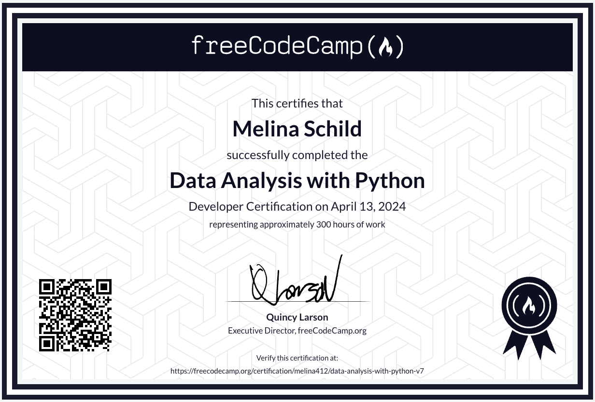

# Data Analysis with Python - freeCodeCamp Certification

This repo contains my personal solutions (python files) and some notes (jupyter notebook) I took to complete the projects.
I removed the the jupyter notebooks in the latest commit though because the file size ruins the github stats otherwise.

click on the certification to validate!

---

more info: [freeCodeCamp](https://www.freecodecamp.org/learn/data-analysis-with-python/)
